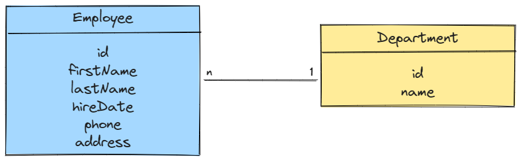

# fullstack-assessment

Andre's FullStack Assessment. 
Project: Simple Employee Maintenance web app

## Data Models

> **All models are defined in src/models/model.js**

## Getting Set Up

The exercise requires [Node.js](https://nodejs.org/en/) to be installed. I recommend using the LTS version.

1. Start by creating a local repository for this folder.

1. In the repo root directory, run `npm install` to gather all dependencies.

1. Next, `npm run seed` will seed the local SQLite database. **Warning: This will drop the database if it exists**. The database lives in a local file `database.sqlite3`.