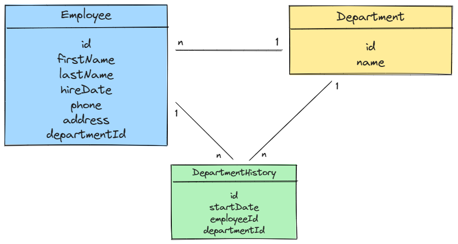

# fullstack-assessment

Andre's FullStack Assessment. 
Project: Simple Employee Maintenance web app

## Data Models

> **All models are defined in src/models/model.js**

# Getting Set Up

The exercise requires [Node.js 16.14 or later](https://nodejs.org/en/) to be installed. I recommend using the LTS version.

1. Start by creating a local repository for this folder.

1. In the repo root directory, open a terminal and run `npm install` to gather all dependencies.

1. Next, on the terminal, `npm run seed` will seed the local SQLite database. **Warning: This will drop the database if it exists**. The database lives in a local file `database.sqlite3`.

# Dev tasks

## How to start the api(backend) and server(front) on Dev

1. Open a terminal and run `npm run start-dev-api` which should start the api. Leave it running.

1. Open another terminal and run `npm run start-dev` which should start the frontend server. Leave it running.

1. Open the URL localhost:3000/ on a browser of your choice.

## How to start the backend server on Debug Mode

> Open the terminal and run `npm run debug-dev-api`

## How to run the tests (Unit and Integration)

> Open the terminal and run `npm run test`

## How to change the running port of the server (frontend)

1. Open the file 'package.json' on the root folder

1. Locate the property "betterScripts" and inside it you will find "start-prod" and "start-dev"

1. Change the property "PORT" for the one that you need (the default Prod port is 8080 and Dev is 3000)

# Prod tasks

## How to start the api(backend) and server(front) on Prod

1. Open a terminal and run `npm run start-prod-api` which should start the api. Leave it running.

1. Open another terminal and run `npm run start-prod` which should start the frontend server. Leave it running.

1. Open the URL localhost:8080/ on a browser of your choice.
